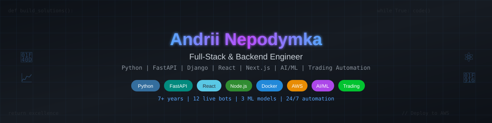

<!-- Banner -->

# 👋 Hi, I’m Andrii

🚀 **Full-Stack & Backend Engineer** — Python, FastAPI, Django, React, Next.js, AI/ML, Trading Automation  
I turn ideas into working products: from architecture and APIs to UI and AI-powered automation.  
📍 **USA (UTC-5)** | 💼 Open to collaboration

---

## 💡 About Me
- 7+ years of experience delivering **web, mobile, and backend** applications
- Proven expertise in **SaaS, Fintech, e-commerce, and healthcare**
- **AI/ML** integrations for automation and data insights
- **AlgoTrading**: bots, screeners, alerts, and risk management
- Passionate about **clean code**, optimization, and scalable architecture

---

## 🛠 Tech Stack

### **Frontend**

### **Backend**

### **AI/ML & Data**

### **Cloud & DevOps**

---

## 🚀 Featured Projects

### **AlgoTrading Bots Platform**
📌 Python, FastAPI, Docker, AWS, Telegram API  
💡 12 live bots + 3 ML models for automated trading and alerts

### **On-Chain Data Screener**
📌 Python, Pandas, Streamlit  
💡 Analyzes and filters blockchain metrics with visualization

### **Full-Stack SaaS Dashboard**
📌 Next.js, Django, AWS  
💡 UI/UX for an analytics SaaS platform with AI integration

---

## 📬 Contacts
- 💼 Upwork: [Profile](https://www.upwork.com/freelancers/pythonaitradingexpert?mp_source=share)  

---
💡 _"Clean code, clear communication, and reliable delivery timelines — that’s how I work."_
